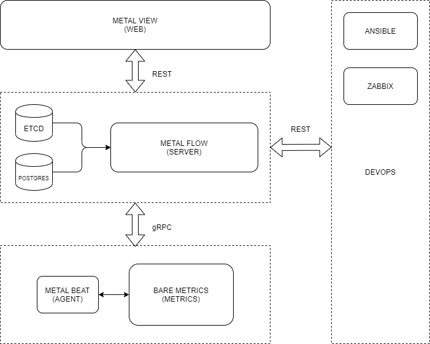

# metalmetrics

[](https://github.com/craftslab/metalmetrics/actions?query=workflow%3ACI)
[](https://hub.docker.com/r/craftslab/metalmetrics)
[](https://github.com/craftslab/metalmetrics/blob/master/LICENSE)
[](https://github.com/craftslab/metalmetrics/tags)


## Introduction

*metalmetrics* is a metrics of *[metalflow](https://github.com/craftslab/metalflow/)* written in Python.


## Requirement

- Python >= 3.7


## Run

```bash
git clone https://github.com/craftslab/metalmetrics.git

cd metalmetrics
pip install -Ur requirements.txt
python metrics.py --config-file="config.yml" --output-file="output.json"
```


## Docker

```bash
git clone https://github.com/craftslab/metalmetrics.git

cd metalmetrics
docker build --no-cache -f Dockerfile -t craftslab/metalmetrics:latest .
docker run -it -p 2379:2379 craftslab/metalmetrics:latest ./metalmetrics --config-file="config.yml" --output-file="output.json"
```


## Usage

```bash
usage: metrics.py [-h] -c CONFIG_FILE [-o OUTPUT_FILE] [-v]

Metal Metrics

optional arguments:
  -h, --help            show this help message and exit
  -c CONFIG_FILE, --config-file CONFIG_FILE
                        config file
  -o OUTPUT_FILE, --output-file OUTPUT_FILE
                        output file (.json|.txt|.xlsx)
  -v, --version         show program's version number and exit
```


## Settings

*metalmetrics* parameters can be set in the directory [config](https://github.com/craftslab/metalmetrics/blob/master/metalmetrics/config).

An example of configuration in [config.yml](https://github.com/craftslab/metalmetrics/blob/master/metalmetrics/config/config.yml):

```yaml
metadata:
  name: metalmetrics
spec:
  bare:
  - cpu
  - disk
  - io
  - ip
  - kernel
  - mac
  - network
  - os
  - process
  - ram
  - ssh
  container:
  kubernetes:
```


## Design




## License

Project License can be found [here](LICENSE).


## Reference

- [health-check-script](https://github.com/SimplyLinuxFAQ/health-check-script)
- [python-diamond](https://github.com/python-diamond/Diamond)
